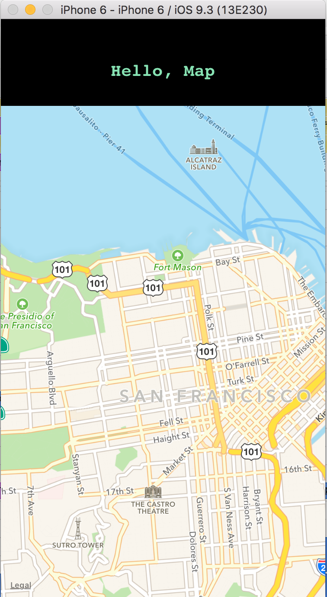

Getting runnign with react-native-maps:

1. `npm install --save react-native-maps`
2. `npm install -g rnpm`
3. `rnpm link`
4. Make sure you restart the dev server so that the new package takes effect.

